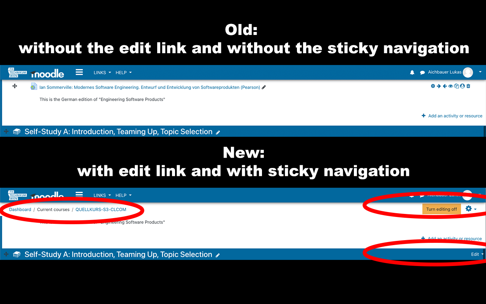

# FHTWMP

> This extension will host additional css and js for the FHTW moodle website!

Currently this extension only hosts additional CSS.

## Installation

Go to the [FHTWMP Chrome Webstore Page](https://chrome.google.com/webstore/detail/fhtwmp/akpnbkmpafkmnfgcjhbbipjaljgfafba) and click on "Add" to install the extension.

## Usage

When the extension is installed you can visit [https://moodle.technikum-wien.at](https://moodle.technikum-wien.at) and you immediately see the changes. Thats all.

## local installation

If you do not want to install the extension via the chrome webstore, or you want to add some CSS or JS just for yourself, you can clone this repository and link the source folder in Chrome.

Visit [chrome://extensions](chrome://extensions) in your chrome web browser. Make sure the toogle in the top right corner is switched on to `developer mode`. Click the button "Load unpacked" and link the src folder of this repository. Everytime you make changes to the source folder you need to click the reload icon on the extension page. 

## Features

* [x] sticky header
* [x] Accordion sections
* [ ] enable No-JS Movement of items via custom button
* [ ] reorder move left / move right button for activity horizontal movement
* [ ] js:prompt - based add link 
